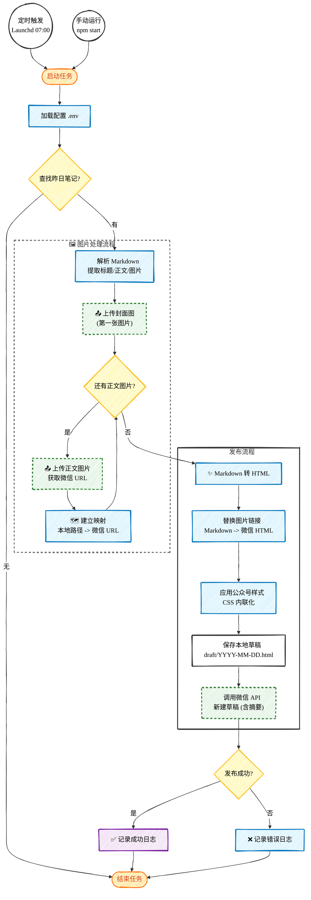

# 微信公众号自动发布流程图 (手绘风格)

此流程图展示了 `publish-article-to-wechat` 项目的核心工作流程。
采用了 Mermaid 的手绘风格配置，在支持的渲染器（如 Obsidian v1.0.0+）中会呈现类似 Excalidraw 的效果。

## 流程说明

1.  **触发**：支持每日定时任务（Launchd）或手动命令行触发。
2.  **查找**：`ObsidianReader` 自动查找**昨日**日期的 Markdown 笔记。
3.  **解析**：提取笔记内容，分离出图片引用。
4.  **图片处理**：
    *   将本地图片上传至微信素材库。
    *   第一张图片默认作为**封面图**。
    *   获取微信服务器的图片 URL。
5.  **转换**：`MarkdownConverter` 将 Markdown 转换为 HTML，并将本地图片路径替换为微信 URL，同时注入专用的 CSS 样式。
6.  **发布**：`WechatAPI` 将最终的 HTML 内容、封面图 ID、摘要等信息提交到微信草稿箱。
